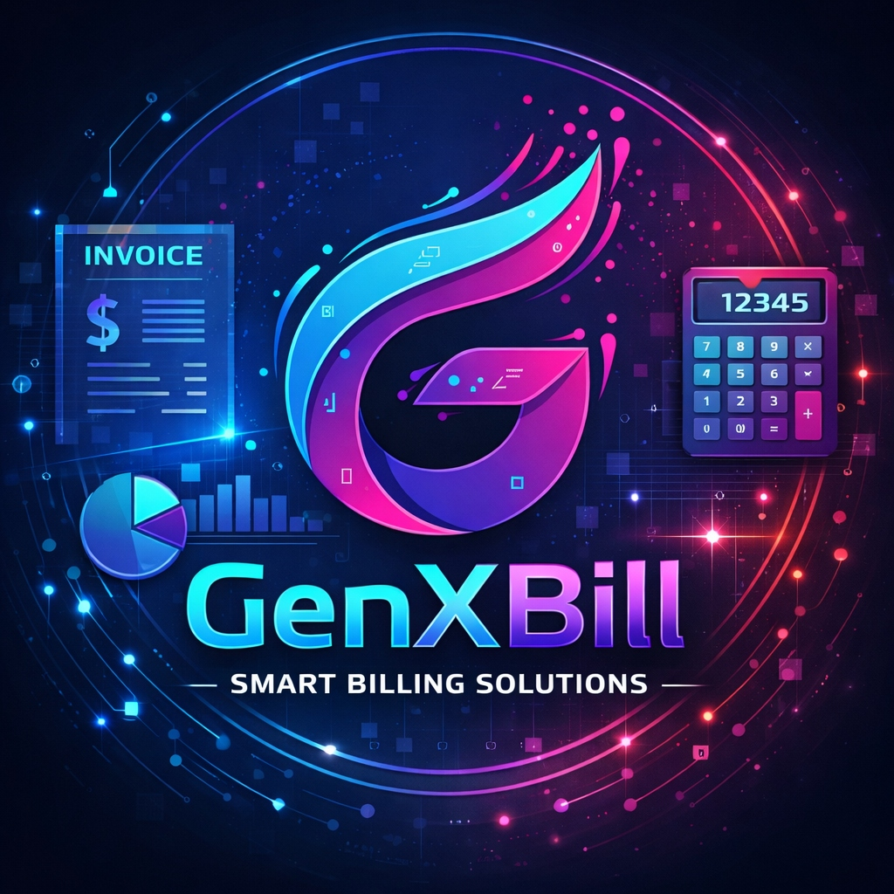

# ⚡ GenXBill
### The Ultimate Open-Source Billing & Inventory Management Suite
**Modern, Fast, and Secure Business Operations for Windows**

---

[🚀 Quick Start](#-installation) • [📦 Download](https://github.com/lalupj07/GenXBill/releases) • [🎥 Demo](#-screenshots) • [🏢 About](#-about-genxis-innovations)

## 🎯 Overview
**GenXBill** is a high-performance, open-source billing and inventory management system built with Flutter. Designed for speed and reliability, it offers a seamless experience for managing sales, stock levels, employee attendance, and business expenses—all in one secure, local environment.

---

## 💎 Features

### 🧾 Smart Invoicing & Billing
*   **Professional PDF Invoices**: Generate beautiful, print-ready PDFs in seconds.
*   **Dynamic Client Management**: Easily track customer history and outstanding payments.
*   **Tax Compliance**: Automated GST/Tax calculations tailored to your region.
*   **Template Support**: Choose from Modern, Classic, or Minimalist themes.

### 📦 Intelligent Inventory Control
*   **Real-time Stock Tracking**: Automatic stock updates as you bill.
*   **Low Stock Alerts**: Intelligent notifications before you run out of products.
*   **HSN/SKU Management**: Full support for standard product coding and categorization.
*   **Stock Forecasting**: Demand-based reordering suggestions.

### 👥 HR & Attendance Suite
*   **Employee Database**: Secure storage for employee records and documents.
*   **Attendance Tracking**: Advanced check-in/out logs with status monitoring.
*   **Leave Management**: Dedicated system for tracking employee time-off.
*   **Role-Based Security**: Administrative controls to protect sensitive data.

### 📊 Business Intelligence
*   **Expense Tracking**: Monitor every penny spent with categorized reporting.
*   **Analytics Dashboard**: Visual overview of sales, revenue, and stock health.
*   **CSV Exports**: Export any data for external auditing and accounting.

---

## 📸 Screenshots

| 📊 Dashboard Overview | 🧾 Invoice Creation |
| :---: | :---: |
|  |  |
| *Real-time business health metrics* | *Intuitive and fast billing interface* |

| 📦 Inventory Management | 👥 HR & Attendance |
| :---: | :---: |
|  |  |
| *Automated stock tracking & alerts* | *Integrated employee management* |

---

## 🛠️ Technology Stack

| Technology | Purpose |
| :--- | :--- |
| **Flutter / Dart** | Cross-platform frontend & logic |
| **Hive** | Ultra-fast local NoSQL database |
| **Riverpod** | Robust state management |
| **Animate_do** | Fluid UI micro-animations |
| **PDF/Printing** | High-quality document generation |

---

## 📥 Installation

| Format | Description | Reliability |
| :--- | :--- | :--- |
| **MSIX Installer** | Official Windows Store-style installer. Recommended for production. | ⭐⭐⭐⭐⭐ |
| **Portable Version** | No installation required. Runs directly from a ZIP file. | ⭐⭐⭐⭐ |

**[👉 Download Latest Release](https://github.com/lalupj07/GenXBill/releases)**

---

## 🔄 Version History

### **v1.0.0**
> *Initial Production Release - Feb 2025*

*   ✨ **New**: Integrated Real-time Inventory Management.
*   ✨ **New**: Advanced HR & Attendance Dashboard.
*   ⚡ **Improved**: Optimized Hive database read/writes for faster loading.
*   🎨 **Improved**: Refined Glassmorphic navigation bar.
*   🐞 **Fixed**: Resolved Hive type ID conflict errors on startup.
*   🐞 **Fixed**: Corrected overflow issues on the Passcode Login screen.

---

## 🏢 About GenXis Innovations
**GenXis Innovations** is committed to building high-quality, open-source tools that empower modern businesses. Based in **Kottayam, Kerala**, we focus on design-driven engineering and privacy-first software.

*   📧 **Email**: [genxisinnovation@outlook.com](mailto:genxisinnovation@outlook.com)
*   🌐 **Website**: [www.genxisinnovation.in](http://www.genxisinnovation.in)
*   📜 **License**: Apache License 2.0
*   ⚖️ **Copyright**: © 2025 GenXis Innovations. All rights reserved.

  <b>Built with ❤️ by GenXis Innovations in Kerala</b>

