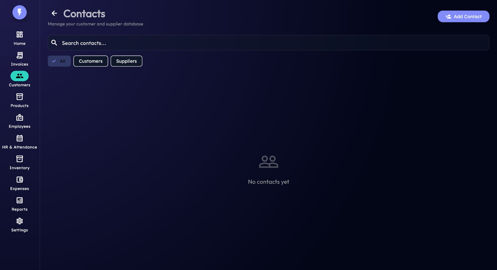
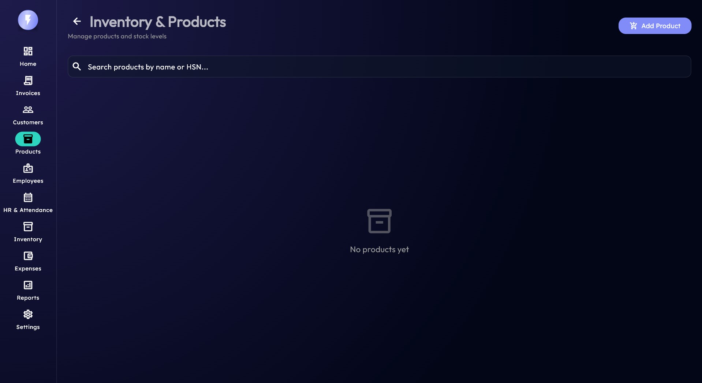
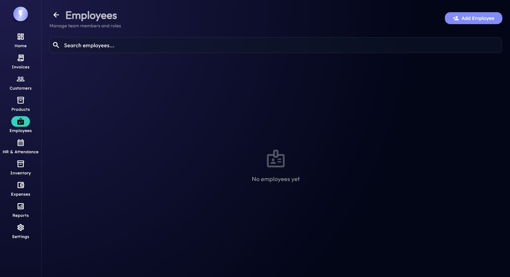

# ⚡ GenXBill
### The Ultimate Open-Source Billing & Inventory Management Suite
**Modern, Fast, and Secure Business Operations for Windows**

---

[🚀 Quick Start](#-installation) • [📦 Download](https://github.com/lalupj07/GenXBill/releases) • [🎥 Demo](#-screenshots) • [🏢 About](#-about-genxis-innovations)

## 🎯 Overview
**GenXBill** is a high-performance, open-source billing and inventory management system built with Flutter. Designed for speed and reliability, it offers a seamless experience for managing sales, stock levels, employee attendance, and business expenses—all in one secure, local environment. Built for **GenXis Innovations**, it emphasizes data privacy and rich user experience.

---

## 📸 Screenshots

### 🏠 Getting Started
| 🎬 Start Screen | 🏠 Home Dashboard |
| :---: | :---: |
|  |  |
| *Modern entry with security* | *Real-time business health metrics* |

### 🧾 Billing & CRM
| 🧾 Invoice Creation | 👥 Customer Management |
| :---: | :---: |
|  |  |
| *Intuitive and fast billing interface* | *Maintain clean customer relationships* |

### 📦 Inventory & Products
| 📦 Advanced Inventory | 🏷️ Product Catalog |
| :---: | :---: |
|  |  |
| *Automated stock tracking & alerts* | *Manage your items efficiently* |

### 👥 HR & Operations
| 💼 HR & Attendance | 👥 Employee Directory |
| :---: | :---: |
|  |  |
| *Track logs and attendance* | *Centralized staff records* |

### 📊 Finance & Analytics
| 💰 Expense Tracking | 📈 Financial Reports |
| :---: | :---: |
|  |  |
| *Monitor every penny spent* | *In-depth business intelligence* |

---

## 💎 Key Features

### 🧾 Smart Invoicing
*   **Professional PDF Invoices**: Generate beautiful, print-ready PDFs in seconds.
*   **Dynamic Client Management**: Easily track customer history and outstanding payments.
*   **Tax Compliance**: Automated Tax calculations tailored to your region.

### 📦 Intelligent Inventory
*   **Real-time Stock Tracking**: Automatic stock updates as you bill.
*   **Low Stock Alerts**: Intelligent notifications before you run out.
*   **HSN/SKU Management**: Full support for standard product coding.

### 👥 Advanced HR Suite
*   **Check-in/Out System**: Interactive attendance logs for all employees.
*   **Leave Management**: System for tracking employee time-off and approvals.
*   **Payroll Records**: Categorized salary and payment history.

### 📊 Financial Insights
*   **Revenue Analytics**: Track your profit margins and sales trends.
*   **Expense Categories**: Detailed breakdown of overheads and operational costs.
*   **Data Portability**: Export reports and data to CSV/Excel format.

---

## 🛠️ Technology Stack
*   **Frontend**: Flutter (Material 3 Design)
*   **Database**: Hive (NoSQL) for lightning-fast disk access.
*   **State Management**: Riverpod.
*   **Animations**: flutter_animate & animate_do.
*   **Reporting**: pdf & printing packages.

---

## 📥 Installation

| Format | Description | Reliability |
| :--- | :--- | :--- |
| **MSIX Installer** | Official Windows Store-style installer. Recommended for production. | ⭐⭐⭐⭐⭐ |
| **Portable Version** | No installation required. Runs directly from a ZIP file. | ⭐⭐⭐⭐ |

**[👉 Download Latest Release](https://github.com/lalupj07/GenXBill/releases)**

---

## 🔄 Detailed Changelog

### **v1.0.0 (The Production Ready Release)**
*   ✨ **New**: **Real-time Inventory Management** with reorder suggestions and stock forecasting.
*   ✨ **New**: **Advanced HR Dashboard** featuring attendance logs and check-in widgets.
*   ✨ **New**: **Financial Reports Module** for in-depth analytics of revenue vs. expenses.
*   ✨ **New**: **About & License Center** integrated into settings for transparency.
*   ⚡ **Performance**: Migrated to a unique Hive TypeID mapping system to prevent database initialization conflicts.
*   🎨 **UI/UX**: Implemented **Glassmorphism** navigation and consistent Material 3 styling throughout the app.
*   🎨 **UI/UX**: Redesigned the **Passcode Login** to be fully responsive and prevent screen overflow on smaller displays.
*   🔧 **Reliability**: Integrated robust logging via `AppLogger` for tracking critical app events.
*   📜 **Legal**: Included Apache 2.0 Licensing and full attribution for **GenXis Innovations**.

---

## 🏢 About GenXis Innovations
**GenXis Innovations** is committed to building high-quality, open-source tools that empower modern businesses. Based in **Kottayam, Kerala**, we focus on design-driven engineering and privacy-first software.

*   📧 **Email**: [genxisinnovation@outlook.com](mailto:genxisinnovation@outlook.com)
*   🌐 **Website**: [www.genxisinnovation.in](http://www.genxisinnovation.in)
*   📜 **License**: Apache License 2.0
*   ⚖️ **Copyright**: © 2025 GenXis Innovations. All rights reserved.

  <b>Built with ❤️ by GenXis Innovations</b>

